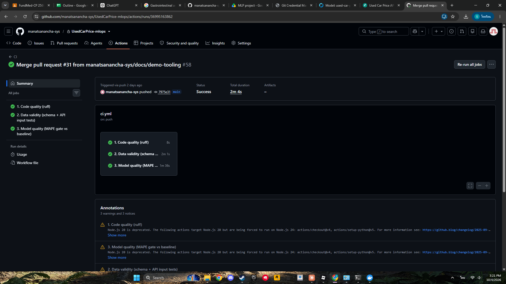
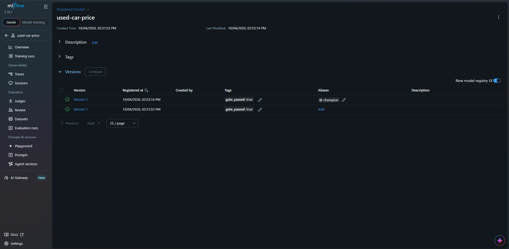
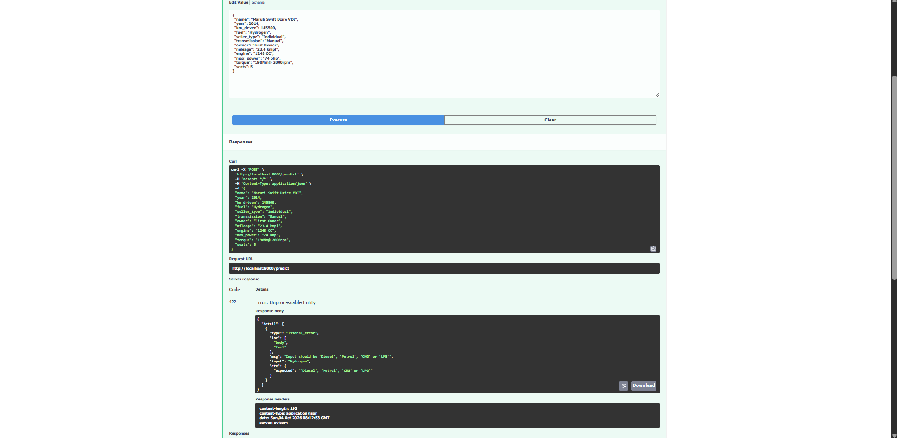

# รายงานการทดสอบ (Test Report)

โปรเจกต์ UsedCarPrice-mlops — ระบบทำนายราคารถมือสอง
รายวิชา CP413008 Machine Learning Engineering for Production

| รายการ | รายละเอียด |
|---|---|
| วันที่ทดสอบ | 6 ตุลาคม 2026 |
| ผู้ทดสอบ | จุฑามาศ ทีหัวช้าง |
| สภาพแวดล้อม | Windows, Python 3.12.10, pytest 9.1.1 (venv ใหม่ติดตั้งจาก `requirements.txt`) |
| โค้ดที่ทดสอบ | branch `main` ล่าสุด ณ วันที่ทดสอบ |

## 1. สรุปผล

| ชุดทดสอบ | คำสั่ง | ผล |
|---|---|---|
| คุณภาพโค้ด | `ruff check .` | ผ่าน (`All checks passed!`) |
| ทดสอบอัตโนมัติ | `pytest -v` | ผ่าน 23 จาก 23 รายการ ใช้เวลา 37.90 วินาที |
| Pipeline ทั้งสาย | `python -m src.pipeline` | สำเร็จ (`=== PIPELINE COMPLETE ===`) |
| เทรนใหม่และเทียบ champion | `python -m src.retrain` | สำเร็จ promote เป็น version 2 |
| CI บน GitHub | GitHub Actions (3 ด้าน) | ผ่านทุกรอบล่าสุดที่ตรวจ |

pytest แสดงคำเตือน (warnings) 2 รายการ เป็น deprecation warning ของไลบรารี (starlette และ mlflow/sqlalchemy) ไม่ใช่ความล้มเหลวของเทสต์ และไม่เกี่ยวกับโค้ดของโปรเจกต์

## 2. ทดสอบอัตโนมัติ (pytest)

มีไฟล์ทดสอบ 3 ไฟล์ รวม 23 รายการ ผ่านทั้งหมด

### 2.1 `tests/test_api.py` (16 รายการ) ทดสอบ API

| ทดสอบ | สิ่งที่ตรวจ | ผล |
|---|---|---|
| `test_valid_car_returns_prices` | ส่งข้อมูลรถที่ถูกต้อง ได้ราคาทำนายกลับมา | ผ่าน |
| `test_invalid_car_is_rejected` (8 กรณี) | ข้อมูลผิดต้องถูกปฏิเสธ (HTTP 422): `fuel_unknown`, `year_out_of_range`, `km_negative`, `seats_too_many`, `seats_zero`, `mileage_no_number`, `engine_negative`, `power_too_high` | ผ่านทั้ง 8 |
| `test_numeric_text_error_names_the_field` | ข้อความ error ระบุชื่อช่องที่ผิด | ผ่าน |
| `test_valid_variants_are_accepted` (3 กรณี) | รูปแบบข้อมูลที่ยอมรับได้: `torque_rpm_range`, `torque_kgm`, `optional_missing` | ผ่านทั้ง 3 |
| `test_training_rows_pass_api_validation` | แถวข้อมูลที่ใช้เทรนต้องผ่านการตรวจของ API | ผ่าน |
| `test_thai_ui_served_at_root` | หน้า UI ภาษาไทยเปิดได้ที่ `/` | ผ่าน |
| `test_openapi_example_predicts_ok` | ตัวอย่างใน `/docs` ทำนายได้สำเร็จ | ผ่าน |

### 2.2 `tests/test_model_quality.py` (2 รายการ) ทดสอบคุณภาพโมเดล

| ทดสอบ | สิ่งที่ตรวจ | ผล |
|---|---|---|
| `test_ridge_passes_mape_gate` | Ridge ผ่านด่าน MAPE ≤ 20% | ผ่าน |
| `test_ridge_beats_baseline` | Ridge ดีกว่า baseline (ราคากลาง) | ผ่าน |

### 2.3 `tests/test_validation.py` (5 รายการ) ทดสอบการตรวจคุณภาพข้อมูล (Pandera)

| ทดสอบ | สิ่งที่ตรวจ | ผล |
|---|---|---|
| `test_good_data_passes` | ข้อมูลที่ถูกต้องผ่าน schema | ผ่าน |
| `test_bad_data_is_caught` (4 กรณี) | ข้อมูลที่ผิด schema ถูกจับได้ | ผ่านทั้ง 4 |

## 3. ตรวจคุณภาพโค้ด (ruff)

```
> ruff check .
All checks passed!
```

## 4. ทดสอบระบบแบบ end-to-end บนเครื่องใหม่

ทำตามขั้นตอนใน README ตั้งแต่ clone จนรันครบ เพื่อยืนยันว่าทำซ้ำผลได้

| ขั้นตอน | ผลที่ได้ |
|---|---|
| `pip install -r requirements.txt` | ติดตั้งสำเร็จ |
| `python -m src.pipeline` | จบด้วย `=== PIPELINE COMPLETE ===` โมเดลที่ดีที่สุดคือ Ridge (val MAE 120,615) ผ่าน gate และเป็น champion version 1 |
| test set (ก่อนเทรนใหม่) | MAE 184,906, MAPE 19.6% (เกณฑ์ ≤ 20%) |
| เฝ้าระวัง drift | ตรวจพบทั้ง Data Drift และ Concept Drift (อัตราส่วน MAE = 1.50 เกินเกณฑ์ 1.3) ซึ่งเป็นการแจ้งเตือนตามที่ออกแบบ ไม่ใช่ข้อผิดพลาด |
| `python -m src.retrain` | challenger version 2 (train + val 5,908 แถว) ได้ MAE 177,922, MAPE 19.2% ดีกว่า champion เดิม จึง promote |
| `python -m src.export_model` | export champion version 2 สำเร็จ |
| MLflow UI | เห็น experiment `used-car-price` ครบ 9 run และ Model Registry มี version 1 และ 2 |

ตัวเลขทั้งหมดตรงกับที่ระบุใน README ทุกค่า แสดงว่าทำซ้ำผลบนเครื่องอื่นได้

## 5. CI (GitHub Actions)

CI รัน 3 ด้านตามที่กำหนดใน `.github/workflows/ci.yml`: ตรวจโค้ดด้วย ruff, ทดสอบข้อมูลและ API, และด่านคุณภาพโมเดล ทุกรอบล่าสุดที่ตรวจ (ทั้งบน `main` และ Pull Request) ผ่านเป็นสีเขียว

## 6. ภาพประกอบ







## 7. ส่วนที่ยังไม่ได้ทดสอบในรอบนี้

ไม่ได้รันซ้ำในรอบทดสอบนี้ ผลล่าสุดอยู่ใน README

| รายการ | หมายเหตุ |
|---|---|
| Docker API (`docker build`, `/health`, `/predict`, `/metrics`) | ผลตัวอย่างอยู่ใน README ขั้นที่ 5 |
| Load test (`scripts/load_test.py`) | ผล SLO ใน README: p50 41.9 ms, p95 95.6 ms, 211.6 req/s, error 0% |
| Rollback (`python -m src.rollback`) | ขั้นตอนอยู่ใน README ขั้นที่ 8 |

## 8. ข้อสังเกต

- การแจ้งเตือน Data Drift ขึ้นว่าตรวจพบทุกครั้ง (ผลล่าสุด 11 จาก 12 คอลัมน์) เพราะข้อมูลถูกแบ่งตามปี คอลัมน์ปีของ train และ test จึงต่างกันโดยธรรมชาติ ควรพิจารณาในการปรับปรุงครั้งต่อไป
- test MAPE (19.2–19.6%) ใกล้เกณฑ์ 20% มาก ถ้าข้อมูลหรือโมเดลเปลี่ยน อาจตกด่านได้ง่าย
